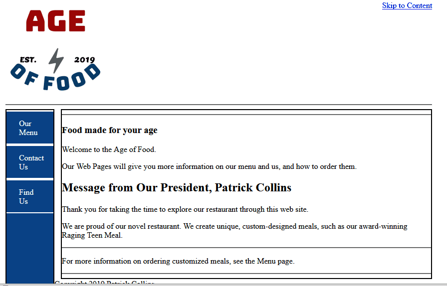

# USI_Webpage_Projects
This repo shows my built web pages durning my class in intro to web development. These pages are written from scratch with notepad++. So they look rough.

### Assignment 3 Yoga Webpage

__[Path to folder](./CSS/ASSIGN/Assignment3_Yoga/)__

### Assignment 4 Restaurant Webpage

__[Path to folder](./CSS/ASSIGN/Assignment4_Testing/)__
